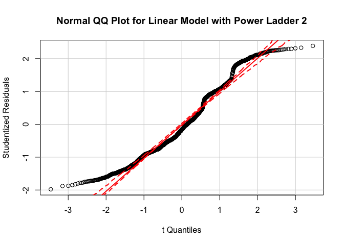

PS3 Regression diagnostics, interaction terms, and missing data
================
Weijia Li

-   [Regression diagnostic](#regression-diagnostic)
    -   [1. Unusual and/or influential observations](#unusual-andor-influential-observations)
    -   [2. Non-normally distributed errors](#non-normally-distributed-errors)
    -   [3. Heteroscedasticity](#heteroscedasticity)
    -   [4. Multicollinearity](#multicollinearity)
-   [Interaction Terms](#interaction-terms)
    -   [1. Marginal effect of age on Joe Biden thermometer rating, conditional on education.](#marginal-effect-of-age-on-joe-biden-thermometer-rating-conditional-on-education.)
    -   [2. Marginal effect of education on Joe Biden thermometer rating, conditional on age.](#marginal-effect-of-education-on-joe-biden-thermometer-rating-conditional-on-age.)
-   [Missing Data](#missing-data)

Regression diagnostic
=====================

### 1. Unusual and/or influential observations

I first draw a bubble plot to visualise leverage, discrepancy and influence. Cooks's D values are marked in red.

From the bubble plot, we can see there are 167 values with high values of leverage, discrepancy, or influence. I am plotting histograms for biden score, age, education level, party affiliation, and gender to see whether these points have high values due to unusual.

There are more unusual or inflential results in groups of old, male, low biden score, and Republicans. Thus I want to improve my model by including interaction terms between Republicans party affiliation and age for further research. Republican party affiliation was not included in the original model so I should first add *R**e**p* as a predictor to my model.

### 2. Non-normally distributed errors

From the normal quantile plot, we can see a clear deviation of the residuels from normal distribution. I thus use a 2-power transformation to make the errors of the model more normal.

### 3. Heteroscedasticity

    ## 
    ##  studentized Breusch-Pagan test
    ## 
    ## data:  lm_biden
    ## BP = 22.559, df = 3, p-value = 4.989e-05

By plotting the results of a Breusch-Pagan test, we can see that heteroscedasticity does present. The heteroscedasticity could misinterpret the estimates for the standard error for each coefficient.

### 4. Multicollinearity

    ##      age   female     educ 
    ## 1.013369 1.001676 1.012275

Looking at the variance inflation factor(VIF), since none of the VIFs is above 10, there is no multicollinearity in the model.

Interaction Terms
=================

    ## 
    ## Call:
    ## lm(formula = biden ~ age + educ + age * educ, data = .)
    ## 
    ## Coefficients:
    ## (Intercept)          age         educ     age:educ  
    ##    38.37351      0.67187      1.65743     -0.04803

### 1. Marginal effect of age on Joe Biden thermometer rating, conditional on education.

    ## Linear hypothesis test
    ## 
    ## Hypothesis:
    ## age  + age:educ = 0
    ## 
    ## Model 1: restricted model
    ## Model 2: biden ~ age + educ + age * educ
    ## 
    ##   Res.Df    RSS Df Sum of Sq     F    Pr(>F)    
    ## 1   1804 985149                                 
    ## 2   1803 976688  1    8461.2 15.62 8.043e-05 ***
    ## ---
    ## Signif. codes:  0 '***' 0.001 '**' 0.01 '*' 0.05 '.' 0.1 ' ' 1

Since p-value is very small, the marginal effect of age is statistically significant. The effects is shown on the plot above.

### 2. Marginal effect of education on Joe Biden thermometer rating, conditional on age.

    ## Linear hypothesis test
    ## 
    ## Hypothesis:
    ## educ  + age:educ = 0
    ## 
    ## Model 1: restricted model
    ## Model 2: biden ~ age + educ + age * educ
    ## 
    ##   Res.Df    RSS Df Sum of Sq      F  Pr(>F)  
    ## 1   1804 979537                              
    ## 2   1803 976688  1    2849.1 5.2595 0.02194 *
    ## ---
    ## Signif. codes:  0 '***' 0.001 '**' 0.01 '*' 0.05 '.' 0.1 ' ' 1

Again, the marginal effect is statistically significant at 0.05 significant level.

Missing Data
============

    ##    Mardia's Multivariate Normality Test 
    ## --------------------------------------- 
    ##    data : biden_3 
    ## 
    ##    g1p            : 1.027052 
    ##    chi.skew       : 312.5663 
    ##    p.value.skew   : 3.417536e-61 
    ## 
    ##    g2p            : 16.09176 
    ##    z.kurtosis     : 4.25879 
    ##    p.value.kurt   : 2.055361e-05 
    ## 
    ##    chi.small.skew : 313.3371 
    ##    p.value.small  : 2.34742e-61 
    ## 
    ##    Result          : Data are not multivariate normal. 
    ## ---------------------------------------

By conducting a Mardia's MVN test, we can see that the predictors are not multivariate normal. I try to use square root transformation on age and education to improve the result.

    ##    Mardia's Multivariate Normality Test 
    ## --------------------------------------- 
    ##    data : biden_tran %>% select(sqrt_educ, sqrt_age) 
    ## 
    ##    g1p            : 3.913214 
    ##    chi.skew       : 1481.804 
    ##    p.value.skew   : 1.261103e-319 
    ## 
    ##    g2p            : 17.31078 
    ##    z.kurtosis     : 55.47539 
    ##    p.value.kurt   : 0 
    ## 
    ##    chi.small.skew : 1485.067 
    ##    p.value.small  : 2.472304e-320 
    ## 
    ##    Result          : Data are not multivariate normal. 
    ## ---------------------------------------

There is no statistically significant difference between the coefficients of the imputed linear model and the original model where rows with 'NA's are removed. This may due to the fact that the dataset do not have many missing values (From Missingness Map).
